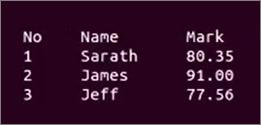
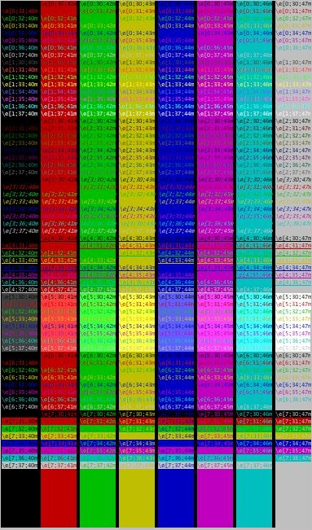

# Getting started with the Linux shell

Shell is also known as the command-line interface. It provides a way for the computer user to interact with the operating system. In this article, we'll overview the basics of the Linux shell, which will give you a robust starting point to use your own Linux machine.

## Prerequisites

A Linux shell comes installed with any computer running the [Linux Operating System](https://www.linux.com/what-is-linux) or any [Virtual Machine box](https://www.virtualbox.org/) with a [Linux distribution](https://www.virtualbox.org/wiki/Linux_Downloads). You may also have access to a shell by logging into a Linux machine over the network with applications like [SSH](https://www.ssh.com/ssh/) or [PuTTY](https://www.putty.org/).

Not all Linux shells speak the same dialect; for example, there may be a variance of commands on different distributions of Linux. However, almost all the commands are the same. It's unlikely that you'll encounter shell variation issues for the commands used in this article because we're covering introductory concepts.

## Get comfortable

Launch the shell terminal, also known as the command-line interface:

* Press the Super key on the keyboard. That's the key with the Windows logo on it. If you have a keyboard without that logo, use the key between the `Ctrl` and `Alt` keys. Or,

* Double-click on the terminal logo. If you don't find the terminal logo on your desktop home page, type "terminal" in the search bar.

Once you've launched a shell, proceed with the next sections to learn about some general-purpose commands. You can run one command at a time by typing the command and hitting the Enter key. Or, you can execute several commands in sequence and by using a semicolon (`;`) as a delimiter.

### Display the date and time

Use the `date` command to display today's date and current time.

```sh
date
```

If you want to know the date of next Monday, run:

```sh
date --date="next mon"
```

The following commands display past dates:

```sh
date --date="3 seconds ago"
```

```sh
date --date="yesterday"
```

```sh
date --date="1 month ago"
```

You can also set a desired time and date with the `-s` flag. For example, the command below sets your current time and date to Mon May 15 17:00:00 PDT 2020.

```sh
date -s "Mon May 15 17:00:00 PDT 2020"
```

There are more advanced data commands, but these are the basics. For your information, the date and time commands on Linux machines start counting at the epoch (1970-01-01 UTC).

### Display a calendar

Use the `cal` command to display the calendar in a tabular format. By default, the command displays the calendar for the current month in the output. Also by default, the current date is highlighted.

```sh
cal
```

To turn off the highlighting for the current date, use the `-h` flag.

```sh
cal -h
```

To display the calendar for a specific month, use the below format. Change the `<N>` placeholder with the desired month's number. Months are ordered from January to December, where `m1` is for January.

```sh
cal -m<N>
```

You can similarly output the calendar for a specific year. Change the `<YYYY>` placeholder with the desired year.

```sh
cal -y <YYYY>
```

### Display your current directory

If you're ever lost, use the `pwd` command to display th location of your current directory.

```sh
pwd
```

## Explore your file system

Now that you're comfortable using the shell environment. Let's show you how to navigate your computer file system.

### Display content in your current directory

The `pwd` command shows you the name of your current directory, but the `ls` command shows you the content of the current directory. In other words, the names of all the files and directories in your current directory.

```sh
ls
```

If you want to see the hidden files, use the `-a` flag.

```sh
ls -a
```

### Make a new directory

You can make one or multiple directories in one command line. The following command makes the _fruits_ and _vegetables_ directories in one command.

```sh
mkdir fruits vegetables
```

### Remove a directory

Use the `rmdir` command to remove a directory from the content listed in the current directory. The following example removes the _vegetables_ directory made in the previous section.

```sh
mkdir vegetables
```

You can remove multiple directories in one command, for example:

```sh
mkdir folder1 folder2 folder3
```

### Manipulate a text file

Make a new text file by using the `cat` command.

```sh
cat > filename.txt
```

Upon making a new file, your shell command line launches an editor. Most shells use Vim or Nano. Type some content for your new text file. Once you're done adding content, press `Ctrl` + `D` to save the file and exit.

To view the file content, use:

```sh
more file.txt
```

or

```sh
less file.txt
```

The main difference between the `more` and the `less` command is that `less` command is faster. It lets you load portions of the file, and allows navigation through the file using the Page-up and Page-down keys. Whereas, the `more` command loads the entire file at once.

To delete a file, use:

```sh
unlink filename.txt
```

or

```sh
rm filename.txt
```

The `rm` command lets you delete multiple files at once, but the `unlink` command only deletes one file at a time. List the files you want to delete without a delimiter when using `rm`. For example:

```sh
rm filename1.txt filename2.txt filename3.txt
```

There are other ways to add, modify, display, and delete files, but the options above are the must-know basics.

### Change directories

Use the `cd` command to jump from one directory to another.

You can go into a sub-directly the following commands. The below commands assume that you have the _fruits_ directory at your current location.

```sh
cd ~/fruits
```

or

```sh
cd fruits
```

You can go to the home directory of your current directory using the following command. The home directory is also called the parent directory:

```sh
cd ..
```

If you want to go all the way up the directory hierarchy, use:

```sh
cd /..
```

We say the `/` is the ancestor of everything in the system, also known as the root of the system.

To navigate to a specific directory using its path, use:

```sh
cd /dir1/dir2/.../file.txt
```

In the above command the `dir1/dir2/.../file.txt` is the path to file.txt. You obtain the path by knowing the names of directories and files in your system. So, you need to become familiar with the folder structure of your machine.

Alternatively, you can start a shell by navigating to the location of the folder, right-clicking, and then choosing the option to launch a terminal at the current location.

## Print something

### echo

The basic command to print in the terminal is `echo`. By default, the `echo` command puts a new line at the end of every Echo invocation. There are three ways to use the `echo` command:

* With double quotes. For example:

  ```sh
  echo "Al Salam Alaikom"
  ```

* With single quotes, such as:

  ```sh
  echo 'Hello'
  ```

* Without quotes:

  ```sh
  echo ciao
  ```

Each method has side effects. When using the `echo` command without quotes, we cannot use a semicolon because it acts as a delimiter for commands in the shell. If you want to print special characters, you must use double quotes for the text, escape the special characters with a forward slash, and surround the forward slash and the special character with double-quotes.

For example, if you want to print text surrounded single-quotes, then you use the format demonstrated below:

```sh
echo " "\'" text "\'""
```

### printf

You can also output text using the `printf` command. It uses the same arguments as the `printf` function in the C language. Here's the general syntax for using the `printf` command.

```sh
printf "Format specifier(s)" "Argument(s)"
```

The `printf` command requires format specifiers for the type of arguments that you want to print. Below is a quick walkthrough of specifiers for different argument substitutions:

* %s for string substitution, by default, aligned to the right. For example:

  ```sh
  printf "First name: %s" "Farah"
  ```

* %f for float number substitution. For example:

  ```sh
  printf "Degree Celsius: %f" "30.5"
  ```

* %d for signed decimal numbers. For example:

  ```sh
  printf "He is %d years old" "100"
  ```

You can also add modifiers to format specifiers. Modifiers are useful for manipulating how the text is printed. Here are a few examples:

* %-s for string substitution with left alignment, with respect to other text outputs

  ```sh
  printf "First name: %-s" "Farah"
  ```

* %5s for string substitution with a string width equal to five characters.

  ```sh
  printf "%50s\n" "This field is 50 characters wide..."
  ```

* %4.2f\n for float number substitution with four characters width. This format rounds to two decimal places, and prints a new line after the substitution.

  ```sh
  printf "Degree Celsius: %4.2f" "30.5"
  ```

The table below lists common format specifiers to use with the `printf` command.

| Specifier | Usage |
| :---- | :---- |
| %d | Signed decimal number |
| %u | Unsigned decimal number|
| %x | Unsigned hexadecimal number with lower-case hex-digits (a-f) |
| %X | Unsigned hexadecimal number with upper-case hex-digits (A-F)|
| %f | Floating point number|
| %e | Double number|
| %c | Char |

Here's a list of common modifiers to add to your format specifiers.

| Modifier | Description |
| :---- | :---- |
| N | Any number: Specifies a minimum field width, if the text to print is shorter, it's padded with spaces, if the text is longer, the field is expanded |
| .W |  Together, the dot and the field width numerical value, truncate any text that's longer than the specified width|
| .N |  Together, the dot and a float or a double number, specify the precision |
| - | Left-bound text printing in the field (the default is right-bound)|
| 0 | Pads numbers with zeros, not spaces |

If you use the wrong type of argument for a format specifier, you run the risk of unexpected output. For example, if you use the `%c` specifier, but pass a string, then only the first character of the string will be printed.

Unlike the `echo` command, the `printf` function does not append a new line character by default. If you want to print a new line, you have to type `\n`.

Here is an example of a script. A script file contains one or more commands to be executed in sequence.

Type the new line character (`\n`), at the end of each command, to neatly print the output. If you use a wrong format specifier, you risk your script crashing.

```sh
printf  "%-5s %-10s %-4s\n" No Name  Mark
printf  "%-5s %-10s %-4.2f\n" 1 Sarath 80.3456
printf  "%-5s %-10s %-4.2f\n" 2 James 90.9989
printf  "%-5s %-10s %-4.2f\n" 3 Jeff 77.564
```

Copy the above example into a file with a .sh extension, and then execute the file using.

```sh
bash filepath/filename.sh
```

or

```sh
sh filepath/filename.sh
```

If you're already at the file location prompt, then you don't have to obtain the file path. You can run either of the commands by only using the filename.

Once your script executes, you should see the following output on the screen.

<center>



</center>

Similarly, you can add other commands to a .sh file, and then execute the file to run the commands in order.

### Flags

When using flags for `echo` or `printf`, make sure the flags appear before any strings in the command. Otherwise, bash will think of the flags as another string.

For example, the `-n` flag can be used to remove the new line that's appended by default in the `echo` command.

```sh
echo -n 'filepath/filename.sh'
```

Echo can also accept escape sequences in double-quoted strings as an argument. Use the `-e` flag. The below example prints `1 2 3`

```sh
echo -e "1\2\3"
```

Without the `-e` flag, the command prints `1\2\3`

### Colors and fancy text

You can print colored text and colored backgrounds, by using the `-e` flag and the default color codes. Different shell terminals may have different color pallets, but the color codes are the same for the same shades of colors.

The tables below list the common text and background color codes:

| Text color | Code |
| :--- | :---|
| Black | 30 |
| Red | 31 |
| Green | 32 |
| Yellow | 33 |
| Blue | 34 |
| Magenta | 35 |
| Cyan | 36 |
| White | 37 |

The following command prints red text, you can change the color value to choose another desired color.

```sh
echo -e "\e[1;31m red text e[0m"
```

You can use the same command above to change the background color.

| Background color | Code |
| :--- | :---|
| Black | 40 |
| Red | 41 |
| Green | 42 |
| Yellow | 43 |
| Blue | 44 |
| Magenta | 45 |
| Cyan | 46 |
| White | 47 |

There are also codes to customize the style of the printed text. The table below describes the most common text styles.

| Text style | code |
| :--- | :---|
| Bold | 1 |
| Dim | 2 |
| Underlined | 4 |
| Blink | 5 |
| Reverse | 7 |

The are several reset codes to undo the color and style of text.

| Reset code | Description |
| :---| :--- |
| 0 | Removes all modifiers for both the foreground and background attributes |
| 21 | Removes bold |
| 22 | Removes dim |
| 24 | Removes underline |
| 25 | Removes blink |
| 27 | Removes reverse |

The general command line format is below. It sets the style, foreground, and the background at once.

```sh
printf -e '\e[S;FG;BGm'
```

### Display all terminal colors

There are several ways to display your terminal color pallets, we'll cover one approach. Copy the code below into a .sh file and execute it using the `sh` or `bash` command.

```sh
for x in {0..8}; do
    for i in {30..37}; do
        for a in {40..47}; do
            echo -ne "\e[$x;$i;$a""m\\\e[$x;$i;$a""m\e[0;37;40m "
        done
        echo
    done
done
echo ""
```

The above code iterates through all possible combinations of the text color, background color, and text style codes. It prints the output of each combination, and the results are shown in the image below.



## Next steps

### Get your command history

The commands you type at your terminal are also known as events. They are saved in a history list, with a default size of 500. You can view your command history by executing the following command:

```sh
history
```

You can also scroll through your history list in the command field by using the Page-up and Page-down keys.

### Get help

If you need help learning more about the Linux shell, use the `man` command. It shows you the reference manual pages organized in sections according to topics that are applicable to your system. Press the Space bar at the keyboard to see one screenful of the manual page at a time. To quit viewing the manual pages, press the `Q` key.

You may also use then `man` command in combination with another command to learn specifically about that one command. For example, the `man ls` shows you the different options you can use with the `ls` command.

## Keep practicing

This article covered the basics of using the Linux  Shell, you'll learn more by practicing. While practicing, you can use the `help` and `history` command to learn more and review previous commands.
